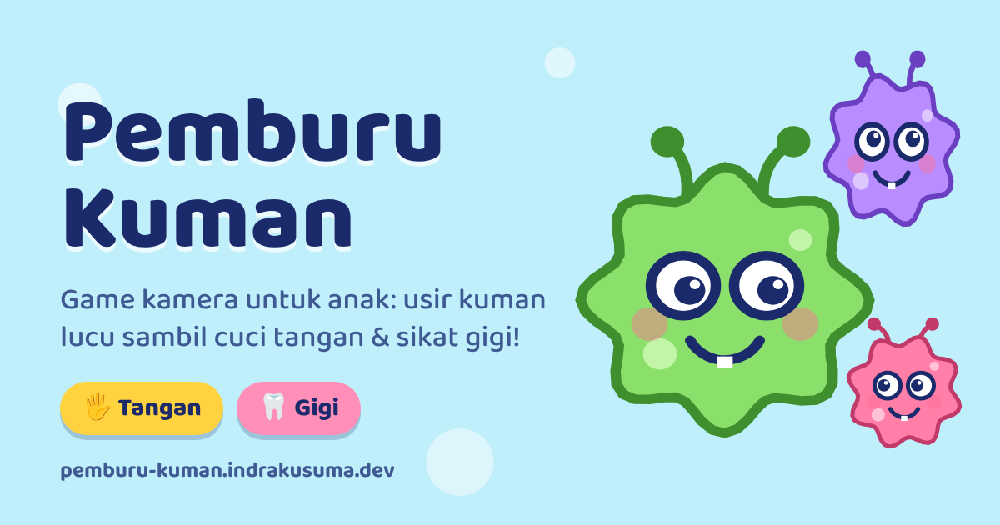

# Pemburu Kuman

**Game kamera untuk anak: usir kuman lucu sambil cuci tangan dan sikat gigi.**

[▶️ Main sekarang](https://pemburu-kuman.indrakusuma.dev) · Dibuat oleh [Indra Kusuma](https://indrakusuma.dev)

## Tentang

Pemburu Kuman membuat rutinitas cuci tangan dan sikat gigi jadi permainan. Anak mengarahkan kamera ke tangan atau gigi, lalu kuman kartun muncul menempel di sana. Untuk mengusirnya, anak harus menggosok tangan pakai sabun atau menyikat gigi sampai semua kuman kabur.

## Fitur

### 🖐️ Mode Tangan
Tunjukkan tangan ke kamera, lalu kuman muncul menempel di kulit. Gosok-gosok tangan seperti sedang cuci tangan pakai sabun sampai 6 kuman kabur.

### 🦷 Mode Gigi
Buka mulut dan senyum lebar ke kamera, lalu kuman muncul di gigi. Sikat gigi sampai 5 kuman kabur.

### 🦠 Kuman yang hidup
- Kuman bergoyang, berkedip, dan matanya melirik ke sana kemari.
- Kuman ikut bergerak menempel di tangan atau gigi.
- Kuman mengejek sebelum diusir ("Jangan pakai sabun yaa!") dan teriak waktu kabur ("Ampun sabun!").
- Ada lima warna kuman dengan ukuran berbeda-beda.

### 👆 Main pakai jari
Selain menggosok di depan kamera, anak juga bisa menekan dan menggosok kuman langsung di layar. Setiap gosokan mengeluarkan gelembung sabun.

### ⭐ Hadiah bintang
Setiap ronde yang selesai memberi satu bintang. Jumlah bintang tersimpan di perangkat, jadi anak bisa terus mengumpulkannya.

### 🔊 Efek suara & animasi
Ada bunyi "pop" saat kuman kabur dan nada kemenangan di akhir ronde, diiringi hujan bintang dan gelembung sabun.

### 📷 Tetap bisa main tanpa kamera
Kalau kamera tidak diizinkan atau tidak tersedia, anak tetap bisa main dengan gambar tangan atau mulut kartun. Ada juga tombol untuk ganti antara kamera depan dan belakang.

### 📱 Ramah anak & ponsel
- Tombolnya besar, warnanya cerah, dan teksnya dalam Bahasa Indonesia yang sederhana.
- Mendukung mode gelap.
- Bisa dipasang ke layar utama HP seperti aplikasi.
- Langsung main di browser tanpa install.

### 🔒 Privasi terjaga
Kamera hanya dipakai di layar permainan. Deteksi tangan dan gigi berjalan sepenuhnya di perangkat, dan tidak ada foto atau video yang disimpan maupun dikirim ke mana pun.

## Pembuat

Dibuat oleh **[Indra Kusuma](https://indrakusuma.dev)**.
